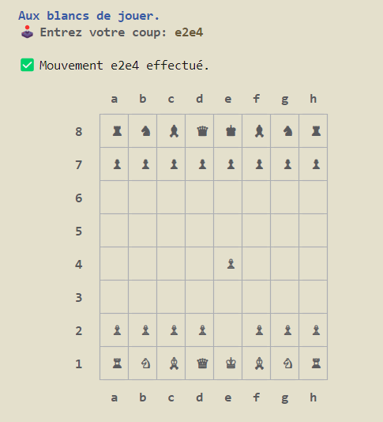

# ♟️👑 Chess Game in C++

Made by [***COUBRET Erwan***](https://github.com/ErwanCoubret)

[](https://www.cplusplus.com/)

## ✍️ Description

This is a simple 2-players chess game written in C++ for a Engineering course at [*Télécom Physique Strasbourg*](https://www.telecom-physique.fr/).

[]

## 📚 How to play

The game is played in the terminal. The game begin directly after launching it (see **🔩 Commands** section)

 Your turn is indicated and you can move the pieces by typing the coordinates of the piece you want to move and the coordinates of the destination square.

## 🔩 Commands

You can run the `makefile` in the root directory to easily do the base commands.

### 🕹️ Build & Run the game
```
make run
```

### 🤖 Level tests

**Individual tests** (number from `1` to `4` for the different levels)
```
make test_<number>
```

**All tests**
```
make tests
```

### 🧹 Clean
```
make clean
```

## 🌳 Project Structure And Files

```bash
< Project >
     | 
     |-- core/                    # Contains the logic of the game & structures  
     |    |-- board.cpp, board.h  # Contains the board structure and functions
     |    |-- interface.cpp, interface.h # Contains the interface functions for printing
     |    |-- pieces.cpp, pieces.h # Contains the pieces structure and functions
     | 
     |-- pictures/                # Contains the images used in the README
     |
     |-- src/
     |    |-- echecs.cpp          # Main file of the project              
     |          
     |-- tests/                    # Contains the tests for the different levels
     |    |-- data/                # Contains the datasets for the tests given by the teacher
     |    |-- perso/               # Contains tests made by me
     |    |-- test-level.sh        # Script to run the tests for the different levels
     |
     |-- makefile                 # Makefile to compile & run the project
     |     
     |-- ************************************************************************
```

## 💭 Feedbacks on the project

- Problems with setPosition()
- found fun to debug even it could be chronovore
- globally a good project to learn C++ and the logic of a chess game, I always thought that a day I would do it and it was a good opportunity to do it
- 